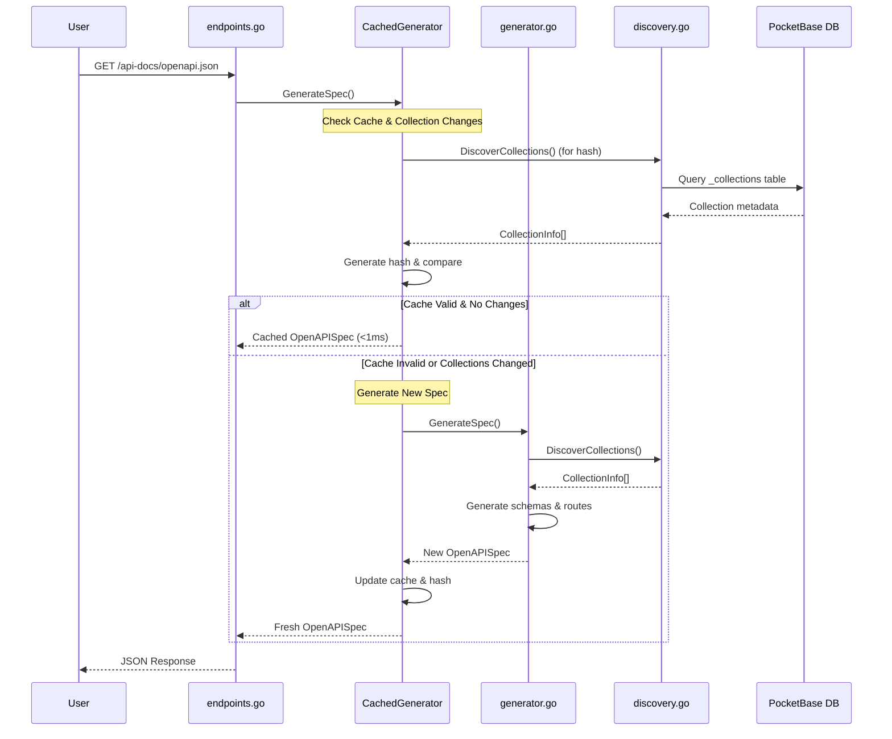

# API Documentation

This document explains how the automatic API documentation system works in the IMS PocketBase BaaS Starter, including interactive API documentation, Scalar ReDoc, and OpenAPI JSON generation with intelligent caching.

## Overview

The API documentation system automatically generates comprehensive API documentation for all your PocketBase collections and custom routes. It features intelligent caching with automatic invalidation when collections change.

### Available Endpoints

- **OpenAPI JSON**: Machine-readable API specification at `/api-docs/openapi.json`
- **Interactive API Docs**: Interactive API explorer at `/api-docs`
- **Scalar**: Sleek, responsive, Postman Alternative documentation at `/api-docs/scalar`
- **ReDoc**: Clean, responsive documentation at `/api-docs/redoc`
- **Collection Stats**: API statistics at `/api-docs/stats`
- **Cache Status**: Cache information at `/api/v1/cache-status`
- **Cache Control**: Manual cache invalidation at `/api-docs/invalidate-cache`

## Key Features

### Intelligent Caching System

- **Automatic cache invalidation** when collections change
- **Thread-safe concurrent access** for multiple users
- **Configurable TTL** (default: 5 minutes)
- **Collection change detection** using metadata hashing
- **Performance optimization** with sub-millisecond cached responses

### Automatic Collection Discovery

- Discovers all PocketBase collections (base, auth, view types)
- Extracts complete field schemas, validation rules, and relationships
- Supports system and custom collections
- Configurable collection exclusion

### Comprehensive Route Generation

- Full CRUD operations for all collections
- Authentication routes for auth collections
- Custom route integration
- File upload support with multipart/form-data
- Dynamic content type handling

## Architecture



## Core Components

### 1. Cached Generator (`cache.go`)

The main entry point that handles caching and automatic invalidation:

```go
// Create cached generator with 5-minute TTL
cachedGenerator := NewCachedGenerator(generator, 5*time.Minute)

// Generate spec with automatic caching and invalidation
spec, err := cachedGenerator.GenerateSpec()
```

**Key Features:**

- **Automatic cache invalidation** when collections change
- **Thread-safe concurrent access** using read-write mutexes
- **Collection change detection** via metadata hashing
- **Configurable TTL** for cache expiration

### 2. Collection Discovery (`discovery.go`)

Discovers and analyzes PocketBase collections:

```go
// Discover all collections
collections, err := discovery.DiscoverCollections()
```

**Returns:** Complete `CollectionInfo` structs with all metadata including fields, rules, and options.

### 3. Schema & Route Generation

The underlying generator creates OpenAPI schemas and routes for all discovered collections, including:

- **CRUD operations** for all collection types
- **Authentication routes** for auth collections
- **Custom routes** for additional endpoints
- **File upload support** with multipart/form-data

## Caching System

### How It Works

1. **First Request**: Generates documentation and caches it with collection metadata hash
2. **Subsequent Requests**: Returns cached version if collections haven't changed
3. **Collection Changes**: Automatically detects changes and regenerates documentation
4. **TTL Expiration**: Cache expires after configured time (default: 5 minutes)

### Cache Invalidation Triggers

The cache automatically invalidates when **any** collection metadata changes:

- New collections added/removed
- Field definitions changed (name, type, required, options)
- Collection settings changed (type, rules, options)
- API access rules modified

### Performance

- **Cache Hit**: <1ms response time
- **Cache Miss**: 100-500ms (full generation)
- **Change Detection**: ~1-5ms (hash comparison)

## Configuration

The system uses sensible defaults and requires minimal configuration:

```go
// Singleton pattern - automatically uses default configuration
generator := apidoc.Initialize(app)

// Get the global generator instance
generator := apidoc.GetInstance()

// Cached generator with 5-minute TTL (used in endpoints)
cachedGenerator := NewCachedGenerator(generator, 5*time.Minute)
```

**Key Settings:**

- **Cache TTL**: 5 minutes (configurable)
- **Singleton Pattern**: Ensures single generator instance across the application

## Singleton Pattern

The apidoc package implements a thread-safe singleton pattern to ensure consistent behavior and resource efficiency:

```go
// Initialize the singleton (called once during app startup)
generator := apidoc.Initialize(app)

// Get the singleton instance anywhere in the application
generator := apidoc.GetInstance()

// Check if singleton is initialized
if apidoc.IsInitialized() {
    // Use the generator
}
```

**Benefits:**
- **Memory Efficiency**: Single generator instance across the application
- **Thread Safety**: Concurrent access is properly synchronized
- **Consistency**: Same configuration and cache across all requests
- **Performance**: Avoids repeated initialization overhead
- **Excluded Collections**: System collections like `_mfas`, `_otps`
- **Dynamic Content Types**: Enabled for file upload support

## API Endpoints

### Documentation Access

| Endpoint                 | Description                |
| ------------------------ | -------------------------- |
| `/api-docs`              | Interactive API Documentation     |
| `/api-docs/scalar`       | Awesome Scalar interface      |
| `/api-docs/redoc`        | Clean ReDoc interface      |
| `/api-docs/openapi.json` | OpenAPI JSON specification |

### Cache Management

| Endpoint                      | Method | Description                           |
| ----------------------------- | ------ | ------------------------------------- |
| `/api/v1/cache-status`        | GET    | View cache status and collection hash |
| `/api-docs/invalidate-cache`  | POST   | Manually clear cache                  |
| `/api-docs/check-collections` | POST   | Check for collection changes          |

### Example Usage

```bash
# View current cache status
curl http://localhost:8090/api/v1/cache-status

# Manually invalidate cache
curl -X POST http://localhost:8090/api-docs/invalidate-cache

# Check for collection changes
curl -X POST http://localhost:8090/api-docs/check-collections
```

**Cache Status Response:**

```json
{
  "cached": true,
  "cache_age": "2m30s",
  "cache_ttl": "5m0s",
  "collections_changed": false,
  "collections_hash": "a1b2c3d4...",
  "expires_in": "2m30s"
}
```

## Development Workflow

### Typical Usage Pattern

1. **Start Development**: Documentation generates automatically on first access
2. **Add Collections**: Cache automatically invalidates when you add/modify collections
3. **View Changes**: Refresh `/api-docs` to see updated documentation
4. **No Manual Steps**: Everything updates automatically

### Testing Collection Changes

```bash
# 1. Check current cache status
curl http://localhost:8090/api/v1/cache-status

# 2. Add a new collection in PocketBase Admin UI

# 3. Check if changes are detected
curl -X POST http://localhost:8090/api-docs/check-collections

# 4. View updated documentation
curl http://localhost:8090/api-docs/openapi.json
```

## Thread Safety

The caching system is fully thread-safe and supports:

- **Concurrent reads** from multiple users
- **Exclusive writes** during cache updates
- **Race condition prevention** with double-checked locking
- **Deadlock prevention** with proper mutex ordering

## Troubleshooting

### Cache Issues

```bash
# Check cache status
curl http://localhost:8090/api/v1/cache-status

# Force cache refresh
curl -X POST http://localhost:8090/api-docs/invalidate-cache
```

### Collection Detection Issues

If collections aren't appearing:

1. Check if they're in the excluded list
2. Verify database connectivity
3. Check collection permissions
4. Review PocketBase logs for errors

### Performance Issues

- **Slow first load**: Normal (100-500ms for generation)
- **Slow subsequent loads**: Check if cache is working via `/api/v1/cache-status`
- **Frequent invalidation**: Collections may be changing frequently
