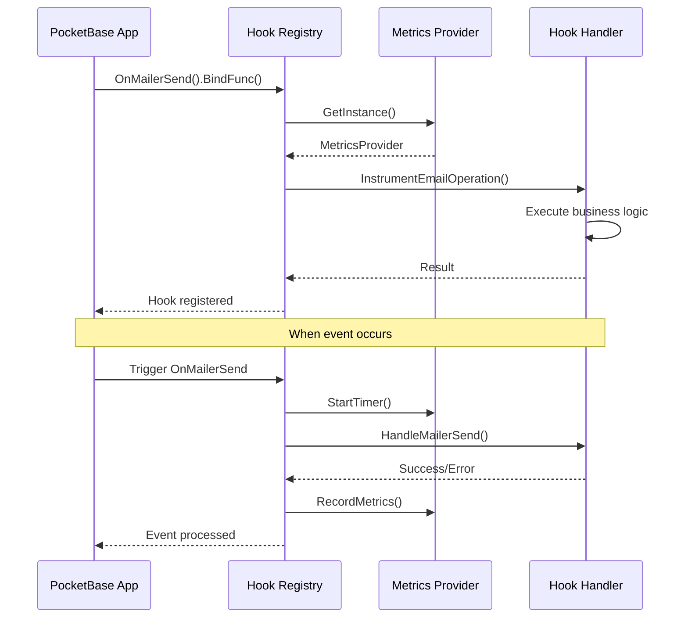
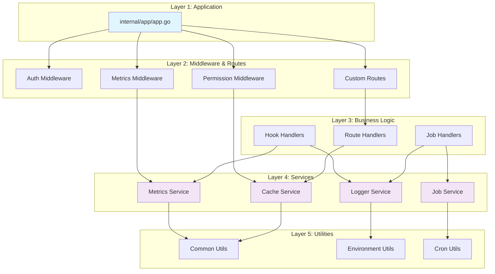
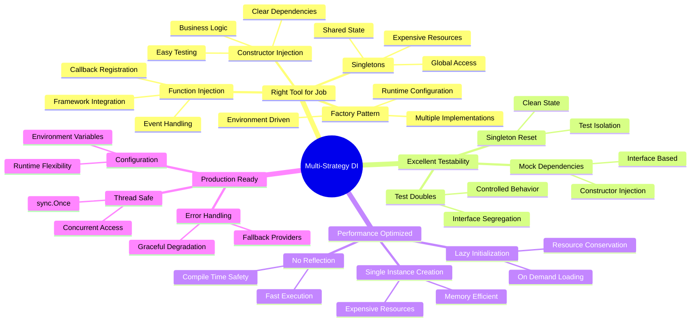

# Dependency Injection Guide

This document explains the dependency injection patterns and strategies used throughout the IMS PocketBase BaaS Starter project.

## Overview

This project demonstrates **multiple dependency injection strategies** working together harmoniously. Unlike frameworks that enforce a single DI approach, this Go application uses different patterns based on the specific needs of each component, resulting in a flexible, testable, and maintainable architecture.

## Why Multiple DI Strategies?

Different components have different lifecycles, access patterns, and requirements:

- **Global Services** need singleton access from anywhere in the application
- **Business Logic Components** need explicit dependencies for testing
- **Configurable Services** need runtime implementation selection
- **Event Handlers** need callback-style dependency injection

## DI Strategies Used

### Architecture Overview


### 1. Singleton Pattern with Lazy Initialization

**Used for:** Expensive, shared resources that should have single instances across the application.

**Examples:**

#### Metrics Provider (`pkg/metrics/metrics.go`)
```go
var (
    instance MetricsProvider
    once     sync.Once
)

// GetInstance returns the singleton metrics provider
func GetInstance() MetricsProvider {
    once.Do(func() {
        config := LoadConfig()
        instance = NewProvider(config)
    })
    return instance
}

// InitializeProvider initializes the singleton with custom config
func InitializeProvider(config Config) MetricsProvider {
    once.Do(func() {
        instance = NewProvider(config)
    })
    return instance
}
```

#### Logger Service (`pkg/logger/logger.go`)
```go
var (
    instance Logger
    once     sync.Once
)

// GetLogger returns the singleton logger instance
func GetLogger(app *pocketbase.PocketBase) Logger {
    once.Do(func() {
        instance = &loggerImpl{
            pbApp:     app,
            storeLogs: true,
        }
    })
    return instance
}
```

#### Cache Service (`pkg/cache/cache.go`)
```go
var (
    instance *CacheService
    once     sync.Once
)

// GetInstance returns the singleton cache service instance
func GetInstance() *CacheService {
    once.Do(func() {
        instance = NewCacheService(CacheConfig{
            DefaultExpiration: 10 * time.Minute,
            CleanupInterval:   15 * time.Minute,
        })
    })
    return instance
}
```

#### Job Manager (`internal/jobs/manager.go`)
```go
var (
    globalJobManager *JobManager
    once             sync.Once
)

// GetJobManager returns the singleton job manager instance
func GetJobManager() *JobManager {
    once.Do(func() {
        globalJobManager = &JobManager{}
    })
    return globalJobManager
}
```

**Benefits:**
- ✅ Thread-safe initialization with `sync.Once`
- ✅ Expensive resources created only once
- ✅ Global access without passing dependencies everywhere
- ✅ Consistent state across the application

#### Singleton Lifecycle Diagram


### 2. Constructor Injection Pattern

**Used for:** Business logic components with clear, explicit dependencies.

**Examples:**

#### Email Job Handler (`internal/handlers/jobs/email_job_handler.go`)
```go
// EmailJobHandler handles email job processing
type EmailJobHandler struct {
    app *pocketbase.PocketBase  // Injected dependency
}

// NewEmailJobHandler creates a new email job handler
func NewEmailJobHandler(app *pocketbase.PocketBase) *EmailJobHandler {
    return &EmailJobHandler{
        app: app,  // Constructor injection
    }
}
```

#### Metrics Middleware (`internal/middlewares/metrics.go`)
```go
// MetricsMiddleware provides HTTP request metrics collection
type MetricsMiddleware struct {
    provider metrics.MetricsProvider  // Injected dependency
}

// NewMetricsMiddleware creates a new metrics middleware
func NewMetricsMiddleware(provider metrics.MetricsProvider) *MetricsMiddleware {
    return &MetricsMiddleware{
        provider: provider,  // Constructor injection
    }
}
```

#### Permission Middleware (`internal/middlewares/permission.go`)
```go
// PermissionMiddleware provides permission-based middleware functionality
type PermissionMiddleware struct {
    cache    *cache.CacheService  // Injected dependency
    cacheKey cache.CacheKey       // Injected dependency
}

// NewPermissionMiddleware creates a new instance of PermissionMiddleware
func NewPermissionMiddleware() *PermissionMiddleware {
    return &PermissionMiddleware{
        cache:    cache.GetInstance(),  // Dependency injection
        cacheKey: cache.CacheKey{},
    }
}
```

#### Data Processing Job Handler (`internal/handlers/jobs/data_job_handler.go`)
```go
// DataProcessingJobHandler handles data processing jobs
type DataProcessingJobHandler struct {
    app *pocketbase.PocketBase  // Injected dependency
}

// NewDataProcessingJobHandler creates a new data processing job handler
func NewDataProcessingJobHandler(app *pocketbase.PocketBase) *DataProcessingJobHandler {
    return &DataProcessingJobHandler{
        app: app,  // Constructor injection
    }
}
```

**Benefits:**
- ✅ Clear dependency requirements
- ✅ Easy to test with mock dependencies
- ✅ Explicit lifecycle management
- ✅ No hidden global state

#### Constructor Injection Flow


### 3. Factory Pattern with Configuration

**Used for:** Creating different implementations based on runtime configuration.

**Examples:**

#### Metrics Provider Factory (`pkg/metrics/metrics.go`)
```go
// NewProvider creates a new metrics provider based on configuration
func NewProvider(config Config) MetricsProvider {
    if !config.IsEnabled() {
        return NewNoOpProvider()
    }

    switch config.Provider {
    case ProviderPrometheus:
        return NewPrometheusProvider(config)
    case ProviderOpenTelemetry:
        return NewOpenTelemetryProvider(config)
    default:
        // Fallback to no-op for unknown providers
        return NewNoOpProvider()
    }
}
```

#### Configuration Loading (`pkg/metrics/config.go`)
```go
// LoadConfig loads metrics configuration from environment variables
func LoadConfig() Config {
    config := Config{
        Provider:  common.GetEnv("METRICS_PROVIDER", ProviderDisabled),
        Enabled:   common.GetEnvBool("METRICS_ENABLED", false),
        Namespace: common.GetEnv("METRICS_NAMESPACE", DefaultNamespace),
        // ... more configuration
    }
    
    // Configuration-driven provider selection
    if !config.Enabled {
        config.Provider = ProviderDisabled
    }
    
    return config
}
```

**Benefits:**
- ✅ Runtime configuration determines implementation
- ✅ Multiple implementations of same interface
- ✅ Clean abstraction over creation logic
- ✅ Environment-driven behavior

#### Factory Pattern Decision Tree


### 4. Function Injection Pattern

**Used for:** Event-driven architecture and callback-style dependencies.

**Examples:**

#### Hook Registration (`internal/hooks/hooks.go`)
```go
// Mailer hooks with metrics instrumentation
func registerMailerHooks(app *pocketbase.PocketBase) {
    app.OnMailerSend().BindFunc(func(e *core.MailerEvent) error {
        // Get the metrics provider instance
        metricsProvider := metrics.GetInstance()

        // Instrument the email operation with metrics collection
        return metrics.InstrumentEmailOperation(metricsProvider, func() error {
            return hook.HandleMailerSend(e)
        })
    })
}

// Record hooks with instrumentation
func registerRecordHooks(app *pocketbase.PocketBase) {
    // User creation with settings initialization
    app.OnRecordCreate("users").BindFunc(func(e *core.RecordEvent) error {
        metricsProvider := metrics.GetInstance()
        
        return metrics.InstrumentHook(metricsProvider, "user_create_settings", func() error {
            return hook.HandleUserCreateSettings(e)
        })
    })
}
```

#### Job Handler Registration (`internal/handlers/jobs/registry.go`)
```go
func InitializeJobHandlers(app *pocketbase.PocketBase, processor *jobutils.JobProcessor) error {
    // Get the registry from the processor (dependency)
    registry := processor.GetRegistry()

    // Register email job handler with dependency injection
    emailHandler := NewEmailJobHandler(app)  // Constructor injection
    if err := registry.Register(emailHandler); err != nil {
        return err
    }

    // Register data processing job handler
    dataHandler := NewDataProcessingJobHandler(app)  // Constructor injection
    if err := registry.Register(dataHandler); err != nil {
        return err
    }

    return nil
}
```

**Benefits:**
- ✅ Event-driven architecture support
- ✅ Flexible callback registration
- ✅ Framework integration (PocketBase hooks)
- ✅ Composable behavior

#### Function Injection in Hook System



### 5. Interface-Based Dependency Injection

**Used throughout:** Loose coupling through interface abstractions.

**Examples:**

#### Metrics Provider Interface (`pkg/metrics/types.go`)
```go
// MetricsProvider defines the interface for all metrics implementations
type MetricsProvider interface {
    // Counter operations
    IncrementCounter(name string, labels map[string]string)
    IncrementCounterBy(name string, value float64, labels map[string]string)
    
    // Histogram operations
    RecordHistogram(name string, value float64, labels map[string]string)
    
    // Gauge operations
    SetGauge(name string, value float64, labels map[string]string)
    
    // Timing operations
    StartTimer(name string, labels map[string]string) Timer
    RecordDuration(name string, duration time.Duration, labels map[string]string)
    
    // Provider-specific operations
    GetHandler() http.Handler
    Shutdown(ctx context.Context) error
}

// Multiple implementations:
// - PrometheusProvider
// - OpenTelemetryProvider  
// - NoOpProvider
```

#### Logger Interface (`pkg/logger/logger.go`)
```go
// Logger interface defines the methods for our custom logger
type Logger interface {
    Debug(msg string, keysAndValues ...any)
    Info(msg string, keysAndValues ...any)
    Warn(msg string, keysAndValues ...any)
    Error(msg string, keysAndValues ...any)
    SetStoreLogs(store bool)
    IsStoringLogs() bool
}

// Implementation: loggerImpl
```

#### Job Handler Interface (`pkg/jobutils/types.go`)
```go
// JobHandler defines the interface that all job handlers must implement
type JobHandler interface {
    // Handle processes a job with the given payload
    Handle(ctx *cronutils.CronExecutionContext, job *JobData) error
    
    // GetJobType returns the job type this handler processes
    GetJobType() string
}

// Multiple implementations:
// - EmailJobHandler
// - DataProcessingJobHandler
```

**Benefits:**
- ✅ Loose coupling between components
- ✅ Easy to swap implementations
- ✅ Testable with mock implementations
- ✅ Clear contracts between layers

#### Interface Implementation Hierarchy


## Complete DI Flow Example

### Application Startup Sequence (`internal/app/app.go`)

```go
func NewApp() *pocketbase.PocketBase {
    app := pocketbase.New()

    // 1. Initialize metrics provider (singleton with factory)
    metricsProvider := metrics.GetInstance()

    // 2. Initialize logger (singleton with app dependency)
    logger := logger.GetLogger(app)

    // 3. Initialize job manager (singleton)
    jobManager := jobs.GetJobManager()
    if err := jobManager.Initialize(app); err != nil {
        log.Fatalf("Failed to initialize job manager: %v", err)
    }

    // 4. Register hooks (function injection)
    hooks.RegisterHooks(app)

    app.OnServe().BindFunc(func(se *core.ServeEvent) error {
        // 5. Create middlewares with constructor injection
        middleware := middlewares.NewAuthMiddleware()
        metricsMiddleware := middlewares.NewMetricsMiddleware(metricsProvider)

        // 6. Initialize swagger generator (singleton)
        generator := swagger.InitializeGenerator(app)

        // 7. Register middleware with dependency injection
        se.Router.Bind(&hook.Handler[*core.RequestEvent]{
            Id:   "metricsCollection",
            Func: metricsMiddleware.RequireMetricsFunc(),
        })

        // 8. Register metrics endpoint (conditional based on provider)
        if handler := metricsProvider.GetHandler(); handler != nil {
            se.Router.GET("/metrics", func(e *core.RequestEvent) error {
                handler.ServeHTTP(e.Response, e.Request)
                return nil
            })
        }

        return se.Next()
    })

    return app
}
```

#### Application Startup DI Flow


## Testing with Dependency Injection

### Mock Dependencies for Testing

```go
// Example from metrics tests
func TestEmailJobHandler(t *testing.T) {
    // Reset singleton for testing
    metrics.Reset()
    
    // Initialize with test configuration
    metrics.InitializeProvider(metrics.Config{
        Provider: metrics.ProviderDisabled,
        Enabled:  false,
    })
    
    // Create handler with mock app
    mockApp := &MockPocketBaseApp{}
    handler := NewEmailJobHandler(mockApp)  // Constructor injection
    
    // Test handler with controlled dependencies
    // ...
}
```

### Singleton Reset for Testing

```go
// From pkg/metrics/metrics.go
func Reset() {
    once = sync.Once{}
    instance = nil
}

// Usage in tests
func TestMetricsProvider(t *testing.T) {
    defer metrics.Reset()  // Clean up after test
    
    provider := metrics.GetInstance()
    // Test with fresh instance
}
```

#### Testing Strategy Diagram

```mermaid
graph TB
    subgraph "Testing Strategies"
        MOCK[Mock Dependencies] --> UNIT[Unit Tests]
        RESET[Singleton Reset] --> UNIT
        INTERFACE[Interface Mocking] --> UNIT
        
        subgraph "Mock Examples"
            MOCK_APP[Mock PocketBase App]
            MOCK_METRICS[Mock Metrics Provider]
            MOCK_CACHE[Mock Cache Service]
        end
        
        subgraph "Reset Examples"
            RESET_METRICS[metrics.Reset()]
            RESET_CACHE[cache.Reset()]
            RESET_LOGGER[logger.Reset()]
        end
        
        MOCK --> MOCK_APP
        MOCK --> MOCK_METRICS
        MOCK --> MOCK_CACHE
        
        RESET --> RESET_METRICS
        RESET --> RESET_CACHE
        RESET --> RESET_LOGGER
    end
    
    subgraph "Test Benefits"
        ISOLATED[Isolated Testing]
        CONTROLLED[Controlled Dependencies]
        FAST[Fast Execution]
        RELIABLE[Reliable Results]
    end
    
    UNIT --> ISOLATED
    UNIT --> CONTROLLED
    UNIT --> FAST
    UNIT --> RELIABLE
    
    style UNIT fill:#e8f5e8
    style ISOLATED fill:#f3e5f5
    style CONTROLLED fill:#f3e5f5
    style FAST fill:#f3e5f5
    style RELIABLE fill:#f3e5f5
```

## Environment-Driven Configuration

### Configuration Loading (`pkg/common/env.go`)

```go
// Environment variable utilities
func GetEnv(key, defaultValue string) string
func GetEnvInt(key string, defaultValue int) int  
func GetEnvBool(key string, defaultValue bool) bool
```

### Configuration Usage (`.env.example`)

```bash
# Metrics configuration - drives factory selection
METRICS_PROVIDER=prometheus          # prometheus, opentelemetry, disabled
METRICS_ENABLED=true                # Master switch
METRICS_NAMESPACE=ims_pocketbase    # Metrics prefix

# Job processing configuration
JOB_MAX_WORKERS=5                   # Worker pool size
JOB_BATCH_SIZE=50                   # Batch processing size
JOB_MAX_RETRIES=3                   # Retry configuration

# OpenTelemetry configuration
OTEL_EXPORTER_OTLP_ENDPOINT=http://localhost:4317
OTEL_EXPORTER_OTLP_HEADERS=api-key=secret
OTEL_EXPORTER_OTLP_INSECURE=true
```

#### Environment Configuration Flow

```mermaid
flowchart LR
    subgraph "Environment Variables"
        ENV_METRICS[METRICS_PROVIDER]
        ENV_ENABLED[METRICS_ENABLED]
        ENV_WORKERS[JOB_MAX_WORKERS]
        ENV_OTEL[OTEL_EXPORTER_OTLP_ENDPOINT]
    end
    
    subgraph "Configuration Loading"
        LOAD_CONFIG[LoadConfig()]
        PARSE_ENV[Parse Environment]
        VALIDATE[Validate Config]
    end
    
    subgraph "Factory Decisions"
        FACTORY[NewProvider()]
        PROM_FACTORY[NewPrometheusProvider()]
        OTEL_FACTORY[NewOpenTelemetryProvider()]
        NOOP_FACTORY[NewNoOpProvider()]
    end
    
    subgraph "Runtime Instances"
        PROM_INST[Prometheus Instance]
        OTEL_INST[OpenTelemetry Instance]
        NOOP_INST[NoOp Instance]
    end
    
    ENV_METRICS --> LOAD_CONFIG
    ENV_ENABLED --> LOAD_CONFIG
    ENV_WORKERS --> LOAD_CONFIG
    ENV_OTEL --> LOAD_CONFIG
    
    LOAD_CONFIG --> PARSE_ENV
    PARSE_ENV --> VALIDATE
    VALIDATE --> FACTORY
    
    FACTORY --> PROM_FACTORY
    FACTORY --> OTEL_FACTORY
    FACTORY --> NOOP_FACTORY
    
    PROM_FACTORY --> PROM_INST
    OTEL_FACTORY --> OTEL_INST
    NOOP_FACTORY --> NOOP_INST
    
    style LOAD_CONFIG fill:#fff3e0
    style FACTORY fill:#e8f5e8
    style PROM_INST fill:#e8f5e8
    style OTEL_INST fill:#e3f2fd
    style NOOP_INST fill:#ffebee
```

## Best Practices Demonstrated

### 1. Consistent Patterns Within Categories

```go
// All singletons follow the same pattern
var (
    instance ServiceType
    once     sync.Once
)

func GetInstance() ServiceType {
    once.Do(func() {
        instance = createInstance()
    })
    return instance
}
```

### 2. Clear Dependency Hierarchy

```
Application Layer (internal/app/)
    ↓
Middleware Layer (internal/middlewares/)
    ↓
Business Logic Layer (internal/handlers/)
    ↓
Package Layer (pkg/)
```

#### Dependency Hierarchy Visualization



### 3. Interface Segregation

```go
// Small, focused interfaces
type MetricsProvider interface { /* ... */ }
type Logger interface { /* ... */ }
type JobHandler interface { /* ... */ }
```

### 4. Graceful Degradation

```go
// Fallback to no-op implementations
func NewProvider(config Config) MetricsProvider {
    if !config.IsEnabled() {
        return NewNoOpProvider()  // Safe fallback
    }
    // ...
}
```

## Advantages of This Multi-Strategy Approach



### 1. **Right Tool for Right Job**
- Singletons for expensive, shared resources
- Constructor injection for business logic
- Factory pattern for configurable services
- Function injection for event handling

### 2. **Excellent Testability**
- Easy to mock constructor-injected dependencies
- Singleton reset functionality for tests
- Interface-based design enables test doubles

### 3. **Performance Optimized**
- Expensive resources created once (singletons)
- No reflection overhead (explicit injection)
- Lazy initialization where appropriate

### 4. **Maintainable Architecture**
- Clear separation of concerns
- Explicit dependency relationships
- Consistent patterns within each category

### 5. **Production Ready**
- Thread-safe implementations
- Graceful error handling
- Environment-driven configuration

## Conclusion

This project demonstrates that **multiple DI strategies can coexist harmoniously** when applied thoughtfully. Each pattern serves a specific purpose:

- **Singleton Pattern**: Global services (metrics, logger, cache)
- **Constructor Injection**: Business logic components
- **Factory Pattern**: Configurable implementations
- **Function Injection**: Event-driven callbacks
- **Interface-Based**: Loose coupling throughout

The result is a **flexible, testable, and maintainable architecture** that follows Go idioms while providing enterprise-grade dependency management.

## References

- **Metrics Package**: `pkg/metrics/` - Singleton + Factory + Interface patterns
- **Logger Package**: `pkg/logger/` - Singleton pattern
- **Cache Package**: `pkg/cache/` - Singleton pattern
- **Job System**: `internal/jobs/`, `pkg/jobutils/` - Constructor + Interface patterns
- **Middlewares**: `internal/middlewares/` - Constructor injection
- **Hooks System**: `internal/hooks/` - Function injection
- **Application Setup**: `internal/app/app.go` - Orchestrates all patterns