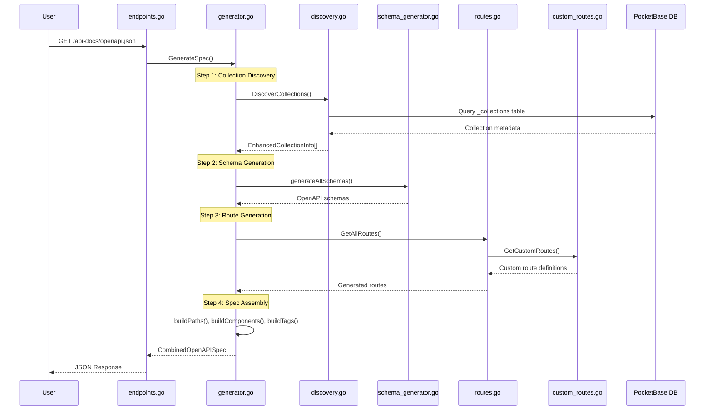

# Swagger API Documentation

This document explains how the automatic API documentation system works in the IMS PocketBase BaaS Starter, including Swagger UI, ReDoc, and OpenAPI JSON generation.

## Overview

The Swagger documentation system automatically generates comprehensive API documentation for all your PocketBase collections and custom routes. It provides multiple interfaces for exploring and testing your API:

- **OpenAPI JSON**: Machine-readable API specification at `/api-docs/openapi.json`
- **Swagger UI**: Interactive API explorer at `/api-docs`
- **ReDoc**: Clean, responsive documentation at `/api-docs/redoc`
- **Collection Stats**: API statistics at `/api-docs/stats`

## Features

### Automatic Collection Discovery

- Discovers all PocketBase collections (base, auth, view types)
- Extracts field schemas, validation rules, and relationships
- Supports system and custom collections
- Configurable collection exclusion

### Comprehensive Route Generation

- Full CRUD operations for all collections
- Authentication routes for auth collections
- Custom route integration
- File upload support with multipart/form-data
- Dynamic content type handling

### Smart Schema Generation

- Field type mapping to OpenAPI schemas
- Validation rules and constraints
- Example data generation
- Relationship field handling
- System field documentation

## Architecture



## Core Components

### 1. Collection Discovery (`discovery.go`)

Responsible for discovering and analyzing PocketBase collections:

```go
// Create discovery service
discovery := NewCollectionDiscoveryWithConfig(
    app,
    config.ExcludedCollections,
    config.IncludeSystem,
)

// Discover all collections
collections, err := discovery.DiscoverCollections()
```

**Key Functions:**

- `DiscoverCollections()`: Finds all accessible collections
- `GetCollection(name)`: Retrieves specific collection metadata
- `ShouldIncludeCollection()`: Applies inclusion/exclusion rules
- `GetCollectionStats()`: Provides collection statistics

### 2. Schema Generation (`schema_generator.go`)

Converts PocketBase field definitions to OpenAPI schemas:

```go
// Generate collection schema
schema, err := schemaGen.GenerateCollectionSchema(collection)

// Generate specialized schemas
createSchema := schemaGen.GenerateCreateSchema(collection)
updateSchema := schemaGen.GenerateUpdateSchema(collection)
listSchema := schemaGen.GenerateListResponseSchema(collection)
```

**Schema Types:**

- **Collection Schema**: Complete field definitions
- **Create Schema**: Fields required/allowed for creation
- **Update Schema**: Fields allowed for updates
- **List Response Schema**: Paginated response format

### 3. Route Generation (`routes.go`)

Creates OpenAPI route definitions for all endpoints:

```go
// Generate CRUD routes
routes, err := routeGen.GenerateCollectionRoutes(collection)

// Generate auth routes for auth collections
authRoutes, err := routeGen.GenerateAuthRoutes(collection)

// Register custom routes
routeGen.RegisterCustomRoute(customRoute)
```

**Generated Routes:**

- `GET /api/collections/{collection}/records` - List records
- `POST /api/collections/{collection}/records` - Create record
- `GET /api/collections/{collection}/records/{id}` - Get record
- `PATCH /api/collections/{collection}/records/{id}` - Update record
- `DELETE /api/collections/{collection}/records/{id}` - Delete record

**Auth Routes (for auth collections):**

- `POST /api/collections/{collection}/auth-with-password` - Login
- `POST /api/collections/{collection}/auth-refresh` - Refresh token
- `POST /api/collections/{collection}/request-password-reset` - Password reset

### 4. Custom Routes (`custom_routes.go`)

Defines additional API endpoints beyond standard CRUD operations:

```go
func defineCustomRoutes() []CustomRoute {
    return []CustomRoute{
        {
            Method:      "GET",
            Path:        "/api/v1/health",
            Summary:     "Health Check",
            Description: "Check API health status",
            Tags:        []string{"System"},
            Protected:   false,
        },
        // Add more custom routes...
    }
}
```

### 5. Main Generator (`generator.go`)

Orchestrates the entire documentation generation process:

```go
// Initialize generator
generator := NewGenerator(app, config)

// Generate complete OpenAPI specification
spec, err := generator.GenerateSpec()
```

## Configuration

### Default Configuration

```go
config := UnifiedConfig{
    Title:                     "IMS Pocketbase API",
    Version:                   "1.0.0",
    Description:               "Auto-generated API documentation",
    ServerURL:                 "http://localhost:8090",
    ExcludedCollections:       []string{"_pb_users_auth_", "_mfas", "_otps"},
    IncludeSystem:             false,
    CustomRoutes:              GetCustomRoutes(),
    EnableAuth:                true,
    IncludeExamples:           true,
    EnableDynamicContentTypes: true,
}
```

### Configuration Options

- **Title**: API documentation title
- **Version**: API version
- **Description**: API description
- **ServerURL**: Base server URL
- **ExcludedCollections**: Collections to exclude from documentation
- **IncludeSystem**: Include system collections
- **CustomRoutes**: Additional custom endpoints
- **EnableAuth**: Include authentication schemas
- **IncludeExamples**: Generate example data
- **EnableDynamicContentTypes**: Support multiple content types

## Usage

### Accessing Documentation

1. **Swagger UI**: Navigate to `http://localhost:8090/api-docs`

   - Interactive API explorer
   - Test endpoints directly
   - View request/response schemas

2. **ReDoc**: Navigate to `http://localhost:8090/api-docs/redoc`

   - Clean, responsive documentation
   - Better for reading and sharing
   - Mobile-friendly interface

3. **OpenAPI JSON**: Access `http://localhost:8090/api-docs/openapi.json`

   - Machine-readable specification
   - Import into Postman, Insomnia, etc.
   - Generate client SDKs

4. **Collection Stats**: Check `http://localhost:8090/api-docs/stats`
   - Collection statistics
   - System health information

### Integration with Development Tools

#### Postman

1. Import the OpenAPI JSON URL: `http://localhost:8090/api-docs/openapi.json`
2. Postman will automatically create a collection with all endpoints
3. Authentication and examples are pre-configured

#### Insomnia

1. Create new request collection
2. Import from URL: `http://localhost:8090/api-docs/openapi.json`
3. All routes and schemas will be imported

#### Client SDK Generation

Use tools like OpenAPI Generator to create client SDKs:

```bash
# Generate JavaScript client
openapi-generator-cli generate -i http://localhost:8090/api-docs/openapi.json -g javascript -o ./client-js

# Generate Python client
openapi-generator-cli generate -i http://localhost:8090/api-docs/openapi.json -g python -o ./client-python
```

## Advanced Features

### File Upload Support

The system automatically detects file fields and generates appropriate schemas:

```json
{
  "requestBody": {
    "content": {
      "application/json": {
        "schema": { "type": "object", "properties": {...} }
      },
      "multipart/form-data": {
        "schema": {
          "type": "object",
          "properties": {
            "avatar": {
              "type": "string",
              "format": "binary"
            }
          }
        }
      }
    }
  }
}
```

### Dynamic Content Types

When enabled, the system provides multiple content type options for endpoints with file fields:

- JSON for text-only updates
- Multipart form data for file uploads
- Hybrid approach for maximum flexibility

### Relationship Documentation

Relation fields are properly documented with:

- Related collection references
- Cardinality constraints (maxSelect, minSelect)
- Cascade delete behavior
- Presentable field information

### Authentication Integration

For auth collections, the system generates:

- JWT bearer token authentication
- Login/logout endpoints
- Password reset flows
- Token refresh mechanisms

## Troubleshooting

### Common Issues

1. **Missing Collections**: Check `ExcludedCollections` configuration
2. **Empty Documentation**: Verify database connection and collection access
3. **Schema Errors**: Check field definitions in PocketBase admin
4. **Custom Routes Not Appearing**: Ensure routes are registered in `custom_routes.go`

### Debug Information

Enable debug logging to see detailed generation process:

```go
log.Printf("Discovered %d collections", len(collections))
log.Printf("Generated %d schemas", len(schemas))
log.Printf("Generated %d routes", len(routes))
```

### Health Check

Use the stats endpoint to verify system health:

```bash
curl http://localhost:8090/api-docs/stats
```

## Best Practices

1. **Collection Naming**: Use clear, consistent collection names
2. **Field Documentation**: Add descriptions to important fields
3. **Custom Routes**: Document custom endpoints thoroughly
4. **Version Control**: Include OpenAPI spec in version control
5. **Testing**: Regularly test generated documentation
6. **Security**: Review exposed endpoints and authentication requirements

## Future Enhancements

- Webhook documentation
- Real-time subscription endpoints
- Advanced filtering documentation
- Custom field type support
- Multi-language documentation
- API versioning support
